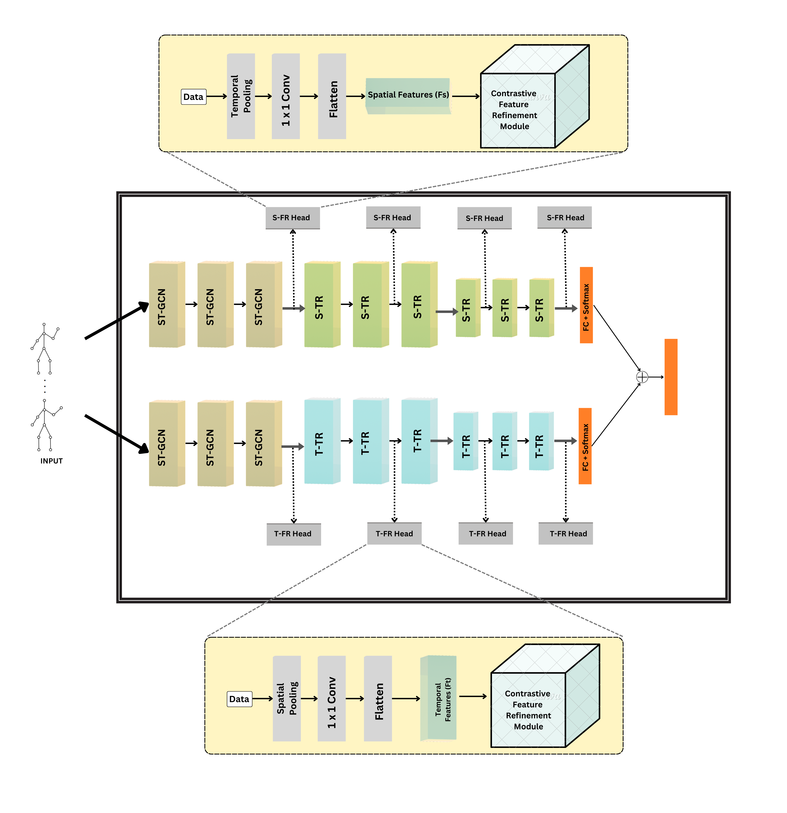

# Skeleton-Based Action Recognition - Dual Stream Learning of Discriminative Representations

This page contains the code related to the paper: [Skeleton-Based Action Recognition - Dual Stream Learning of Discriminative Representations] accepted in CVIP 2024

## Abstract
Skeletal data plays a pivotal role in human action recognition due to the compact form of pose information inherent in the skeletal structure. Graph Convolutional Networks (GCNs) alongwith attention mechanisms are showing good results for skeleton based action recognition based on the natural graph representation of the skeleton. However,such combinations of GCN and attention often fail to capture the spatial relationships between the body parts. We propose a dual-stream architecture integrating Spatial and Temporal Transformer Networks for Skeleton-based Action Recognition (SAR). The proposed approach leverages GCNs and Attention Mechanisms to model spatial relationships between skeletal joints and temporal dynamics in action sequences. Additionally, we introduce a Feature Refinement Head using contrastive learning to enhance discriminative feature representations. Experimental results on benchmark datasets demonstrate that our method achieves state-of-the-art performance in recognizing human actions from skeleton data.

The model architecture is :

